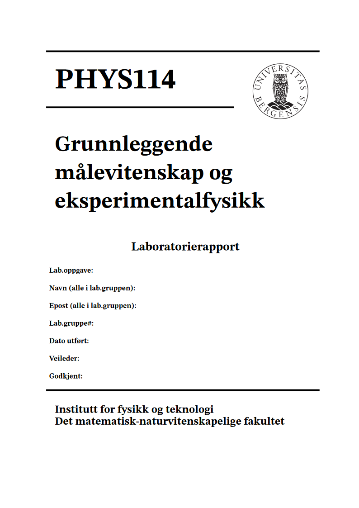

# Structured-UIB - A lab report template for the course PHYS114 at UiB

Report template to be used for laboratory reports in the course PHYS114 - Basic Measurement Science and Experimental Physics, at the University of Bergen (https://www.uib.no/en/courses/PHYS114). The template is in Norwegian only as of now. English support may be added in the future.

The name of the package is arbitrary such that it follows the naming guidelines of Typst. 

Usage:
```typ
// IMPORTS
#import "@preview/structured-uib:0.1.0": *

// TEMPLATE SETTINGS
#show: report.with(
  task_no: "1",
  task_name: "Måling og behandling av måledata",
  authors: (
    "Student Enersen",
    "Student Toersen", 
    "Student Treersen"
  ),
  mails: (
    "student.enersen@student.uib.no", 
    "student.toersen@student.uib.no", 
    "student.treersen@student.uib.no"
  ),
  group: "1-1",
  date: "29. Apr. 2024",
  supervisor: "Professor Professorsen",
)

// CONTENT HERE...
```

Front page:


## Licenses
`lib.typ` is licensed under MIT. The contents of the `template/` directory are licensed under MIT-0. The logo/emblem of the University of Bergen (located at `media/uib-emblem.svg`) is owned by their respective owners.